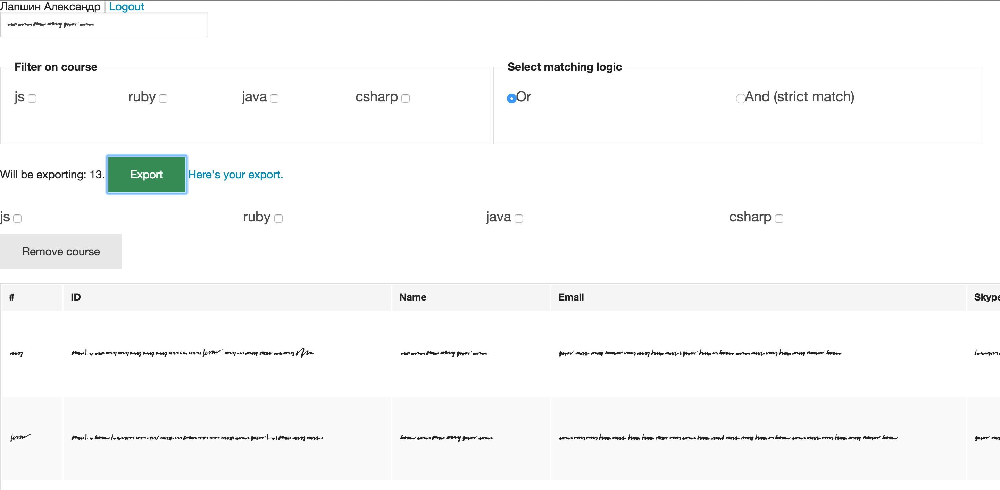
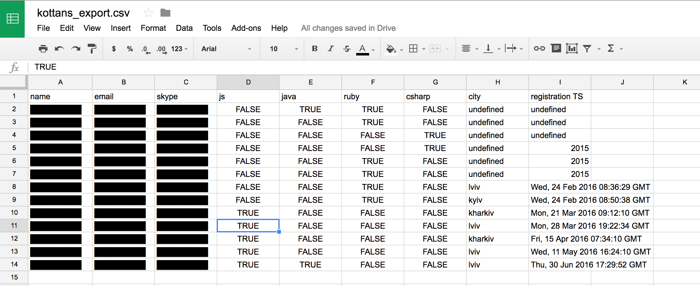

# kottans-course-bootstrap

## About this repo and Kottans course

Hello there!
Possibly, you landed here from somewhere on the web or one of the fellow kottans gave you a link to this doc.
This repo is intended to provide a high-level frameworkish guide of creating and running a course, supposedly, related to kottans.
'So anyone can run a kottans course?' – one can ask. Answer is yes*
`*` - given you follow some principals like:
  1. being nice
  2. not taking money for the course and thus using kottans™ name for making a profit.

I foresee rule #2 having some sort of exceptions which should be agreed upon by most kottans, but #1 is a must.

## Setting your expectations for results and time involvement

Creating a course takes time, energy, cognitive resources and, possibly, money. You won't get instantly-famous, you won't become an IT rockstar, you won't become women/men magnet. But I promise you would meet some great people, learn something new along the way, be it things about people nature, the technology you love, productivity, community.
Course length can vary. Historically, there were courses from 2.5 to 5 month long.
Preparation for the course, based on available resources, program materials, and a team might vary from week to several months.

## All the things you need to run a course

1. Motivated team
2. Shared vision
3. Program
4. Venue
5. Students

### Team
Ideally, more than 3 people.
At least one 'manager'/'problem-solver', can be part-timer. Should take care of
+ registration + task handouts
+ solving interview related question
+ venue sponsor related question
+ setting up and maintaining calendars / actual schedules with appointed coaches
+ setting up and maintaining progress tracking pages

At least 2 core members, familiar with technology.
Both should be self-identifying as middle/senior on the given topic.
Why at least 2 core members? It's too much to handle for a single person, and having 2 members reduces the risk of coach missing our the lecture due to personal/work related unexpected involvement.

Along the way, there might be (and should be) guest speakers. Guest speakers are great as inviting them reduces the pressure on the core team, students will learn about other people / use cases in the community, and guest speakers usually might have more relevant experience regarding topic discussed. Be aware, that unlike core members, guest speakers tend to be less reliable, as they are less involved and occasionally might forget about the lecture they agreed to teach, refuse to come, etc. This is the hard part, as core member should be able to either jump in and cover the topic nonetheless or work around program and switch topic to the one scheduled for later.

### Shared vision
Team should be sharing vision about
+ for whom the course should be most beneficial (i.e. target audience – language switchers / junior devs with no previous experience, etc.). At this step, the prerequisite knowledge and level of topics (beginner, advanced, pro) can be defined.
+ what should be the end goal of the course (i.e. people being really familiar with core Ruby and being able to work with Rails, etc).

Based on this two, usually, you would be able to conclude what should be the minimal knowledge/skillset required to achieve this.

### Program
Based on team's skillset and shared vision, you can now try to approach taming the beast of forming the program. The issue with creating a program is conflict between wanting to go over all the important things™ in depth, wanting to explain everything from bottom to top and finally not to turn this into endless courses without actual full stop.
Usually, courses would be having 2 lectures per week during working days (around 1.5 hours each) and a workshop once every two weeks, that can last for several hours (4-6). There's also homework related to the topic.

Few possible recommendations:
+ don't plan courses for more than 16 weeks, unless you plan to switch all coaches and students with some new people along the course :). Try shaving the scope of courses, utilizing the power of self-education and good explanatory videos, formulating the core aspects needed to grasp the technology etc.
+ given there are two lectures a week it might make sense to break up things logically to cover bigger topic during same week, not splitting those across weekend
+ workshops should be optional, i.e. skipping workshop shouldn't harm student's progressing the course further (as this usually takes time on a weekend and people tend to have real life, work and weekends never will work for everyone). Instead, think of this time as an opportunity to do something fun, hack on something small, built functional prototype/app, play with something niche, i.e.: if mission states we want in the end to have people familiar with ruby and rails, it might be a fun thing to hack on ruby internals; if mission states we want in the end to have people familiar with core js and have some idea of high-level js frameworks, it might be a fun thing to play with Three.js/d3/canvases/phaser/tessel, etc. To sum up: bring some fun to the course and talk about related, but not core things
+ think who might be a good suit for a guest speaker for the topic: other kottans, gitter communities, speakers at local meetups/conferences might be of help to determine this. Think about who would be a backup coach, just in case guest speaker won't be able to make it. There were cases when the guest speaker was presenting from another city / abroad, using google hangouts. Keep in mind, this is less effective.
+ plan for intro and outro sessions.
+ given there are two sessions per week, homework after the first one might be 'lighter' and be less time consuming (maybe, read some docs/articles/books or view videos etc.), and bigger homework should be assigned for weekend break

After that you will need to:
  1. Create final list of topics
  2. Break up topics and workshops by week with calendar timeline
  3. Put down high-level contents of each session. Sample breakup for js course

  ```
    Topic: HTML
    + meta tags, semantics, document outline, forms, input elements, tables)
    + Markup languages
    + Before HTML5: history of HTML
    + HTML5: semantic web
    + Beyond HTML5
    + [PostHTML]
    Topic: CSS    #1
    + CSS 2.1 (margin collapse, box model, inline vs block, floats/clears)
    Topic: CSS    #2
    + CSS 3 (flexboxes, transitions/animations, mention box layouts, grids…)
  ```

  4. Assign primary and backup coach
  5. Discuss fallback strategy in case someone is sick / not showing up / etc. (Identify, which topics can be moved around, what can be skipped and revisited later in other topics, etc)
  6. Get ready with some materials for core topics for sure (usually, that would be [slides](http://kottans.org/#slides)). You will want to have those ready 2 weeks in advance before the actual lecture for everyone to review/provide feedback.

### Venue
Usually, a friendly company would be hosting our initiative's course. Sometimes we know the people who know the people on the inside, sometimes our fellow kottans are owning/working for such company, sometimes you have to go and ask.
Other that getting necessary info via word of mouth, you can try using local development communities to find relevant information (might be looking for topics like [this](https://dou.ua/lenta/articles/gde-provesti-meropriyatie/), [this](https://dou.ua/lenta/articles/welcome-to-companies-4/) or [this](https://dou.ua/lenta/articles/welcome-to-kyiv-companies/)).
Venue requirements:
+ enough space for all students and coaches
+ projector / big screen to show presentation / live coding (although could bring your own projector, etc.)
+ stable internet connection (although backup option could be using 3g modems, cell phone tethering etc.)
+ WC / water in accessible proximity, optionally cookies/snacks/food
+ being free for the time of the course
+ optionally: microphone
+ optionally: air conditioning

### Students
A group might vary in size, given the actual course mission, venue, speakers level etc. Given we are usually targeting offline format, it's usually most productive to have 15-25 students.

Usually, group would include motivated and curious future kottans or alumni kottans that are thirsting for new skills. To achieve this, prior to course, there's
  1. a test assignment being sent out to everyone who wants to attend course
  2. an in-person interview to assess some social skills, motivation, and level of applicant

Be aware that students tend to drop out the course. Drop rate might vary per course, based on its length, complexity, engagement and may vary from 10-15% to 66-80% (just a ration of students that are not making it till the end). Apart from personal reasons students might be dropping out, there's also a possibility that coaches can decide to exclude someone from the course in case of not keeping up with homeworks for a long time (usually, baseline is you can have at most 3 home assignments not done until coach would interfere) or other reasons (rude behaviour?).

## Description of actual processes

>_Quick tip on managing files: create google drive folder for a course and share it with everyone involved. Store artifacts there_

### Announcing course

Usually, you would want people to know there's a course coming.
You might want to
1. Do a post on facebook and contact your local communities. For example, in Ukraine it may be [dou](https://dou.ua). Like [this](https://dou.ua/forums/topic/14054/), [this](https://dou.ua/forums/topic/8181/) or [this](http://ain.ua/2016/02/23/634216) etc.
2. Tweet and get retweet / post from [@kottans_org](twitter.com/kottans_org) account.

### Getting registrations

People are applying for the course(s) through [our site](http://kottans.org/#contact).

1. Get an access to [application monitor](http://kottans.github.io/application-monitor).
2. Set corresponding filters, matching a subset of students you are interested in. Be aware it's somewhat laggy and slow.

3. Click export. Supposedly, if you exported student for some course, you would like to check that language checkbox & click 'Remove', so that person would not show up for the same language filter in the future (we want to remove people from the list so that they will get application email only once. If they want in next year, they should register again).

4. You will get spreadsheet  that can be further used. Usually, you would do several exports (as people tend to start registering when the course is announced) and merge those together.

There's also a possibility you would be creating a course that we never had before and thus you might need to modify [application monitor](https://github.com/kottans/application-monitor) to support corresponding columns / filtering / export.

> _Note: we previously also had 'beta'-course, that wasn't available for a wide audience but was more of 'by kottans for kottans'. In that case, there's a different flow for getting registrations/test task/interviews._

### Sending out test assignment

You will need to have test assignment text ready.
Sample test assignments from JS course few years ago: [Contact Book](https://docs.google.com/document/d/1a0q0TQDEShK_3xzUEeUWe4Vuipc4haMXzZyIDTDslvk/edit?usp=sharing), [Gaussian solver](https://gist.github.com/programulya/659481e897de02408d57). Quantity and complexity of tasks depend solely on the quantity of participants and mission. Be sure to agree in the team on general criteria used to measure completeness/quality of the solution.
You will also need a template for email. Sample email from a few years ago can [be found here](https://docs.google.com/document/d/1NdzuedOws88hTeMejvFjnLY0E6vIXGeEcmjzkPLNoME/edit?usp=sharing).

### Setting up interview
### Interview feedback
### Setting up courses
### Running the course / workshops
### Tracking progress
### Providing feedback
